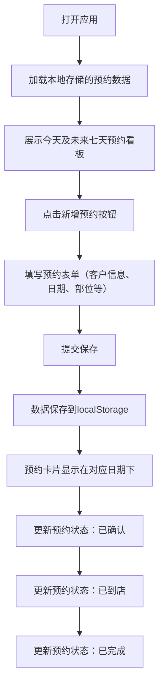

## 1. 产品概述

纹身工作室预约看板是一个专为小型纹身工作室设计的预约管理工具，帮助纹身师高效管理客户预约、跟踪预约状态、记录客户需求信息。

- 主要用途：管理每日预约、跟踪客户到店情况、记录纹身需求细节
- 目标用户：小型纹身工作室的纹身师和前台管理人员
- 核心价值：简化预约流程，减少沟通成本，提升客户服务体验

## 2. 核心功能

### 2.1 用户角色

| 角色 | 注册方式 | 核心权限 |
|------|----------|----------|
| 工作室管理员 | 无需注册（本地使用） | 新增、编辑、删除预约，更新预约状态，查看全部预约 |

### 2.2 功能模块

1. **预约看板首页**：按日期展示预约卡片，支持日期筛选和状态筛选
2. **新增预约表单**：录入客户预约信息的完整表单
3. **预约状态管理**：支持标记预约为已确认、已到店、已完成
4. **本地数据持久化**：所有数据存储在浏览器本地，刷新不丢失

### 2.3 页面详情

| 页面名称 | 模块名称 | 功能描述 |
|----------|----------|----------|
| 预约看板首页 | 日期导航栏 | 显示今天及未来七天，支持点击切换日期 |
| 预约看板首页 | 预约卡片列表 | 按日期分组展示预约卡片，显示客户昵称、时间、部位等信息 |
| 预约看板首页 | 状态标签 | 显示预约当前状态（待确认/已确认/已到店/已完成） |
| 预约看板首页 | 新增预约按钮 | 打开新增预约弹窗 |
| 新增预约弹窗 | 客户信息表单 | 录入客户昵称、预约日期、纹身部位、预计时长、参考图链接、定金状态、备注 |
| 预约卡片 | 状态操作按钮 | 快速切换预约状态（确认、到店、完成） |
| 预约卡片 | 编辑/删除 | 支持修改预约信息和删除预约 |

## 3. 核心流程

用户打开应用 → 查看今日及未来七天预约 → 点击新增预约 → 填写客户信息表单 → 提交保存 → 预约显示在对应日期下 → 根据进度更新预约状态（已确认→已到店→已完成）

## 4. 用户界面设计

### 4.1 设计风格

- **主色调**：深黑色 (#121212) 搭配金色/古铜色 (#B8860B) 作为点缀色，体现纹身工作室的专业和艺术感
- **辅助色**：深红 (#8B0000) 表示警示或待处理状态，墨绿 (#2F4F4F) 表示完成状态
- **背景**：深色背景配合轻微纹理，营造工作室氛围
- **按钮风格**：圆角矩形，边框细腻，hover 时有轻微上浮效果
- **字体**：标题使用具有艺术感的衬线字体，正文使用清晰易读的无衬线字体
- **布局风格**：卡片式布局，每个预约为独立卡片，按日期列纵向排列
- **图标风格**：简约线性图标，与整体风格统一

### 4.2 页面设计概述

| 页面名称 | 模块名称 | UI 元素 |
|----------|----------|---------|
| 预约看板首页 | 顶部标题栏 | 工作室名称、当前日期、新增预约按钮 |
| 预约看板首页 | 日期横向滚动栏 | 七天日期标签，今天高亮显示 |
| 预约看板首页 | 预约卡片网格 | 深色卡片、金色状态标签、客户信息展示 |
| 新增预约弹窗 | 表单区域 | 深色表单、金色边框聚焦效果、提交按钮 |
| 预约卡片 | 状态按钮组 | 三个状态切换按钮，当前状态高亮 |

### 4.3 响应式

- 桌面端：日期横向排列，预约卡片以网格或列表形式展示
- 平板端：保持横向布局，适当缩小间距
- 移动端：日期支持横向滚动，预约卡片单列展示
- 所有交互元素支持触摸操作，按钮大小适合点击

### 4.4 动效设计

- 页面加载：预约卡片渐入并轻微上浮
- 状态切换：颜色过渡动画，平滑自然
- 弹窗：背景模糊 + 缩放出现效果
- Hover 效果：卡片轻微上浮，阴影加深
