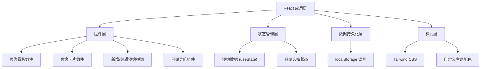

## 1. 架构设计



## 2. 技术描述

- **前端框架**: React@18 + TypeScript
- **构建工具**: Vite@5
- **样式方案**: Tailwind CSS@3
- **数据存储**: 浏览器 localStorage
- **无后端、无外部服务依赖**

## 3. 目录结构

```
src/
├── components/
│   ├── AppointmentBoard.tsx    # 预约看板主组件
│   ├── AppointmentCard.tsx     # 预约卡片组件
│   ├── AppointmentModal.tsx    # 新增/编辑预约弹窗
│   └── DateNavigator.tsx       # 日期导航组件
├── hooks/
│   └── useLocalStorage.ts      # localStorage 自定义 Hook
├── types/
│   └── index.ts                # TypeScript 类型定义
├── utils/
│   └── dateUtils.ts            # 日期工具函数
├── App.tsx                     # 应用入口组件
├── main.tsx                    # React 入口
└── index.css                   # 全局样式与 Tailwind 配置
```

## 4. 数据模型

### 4.1 类型定义

```typescript
// 预约状态类型
type AppointmentStatus = 'pending' | 'confirmed' | 'arrived' | 'completed';

// 预约数据模型
interface Appointment {
  id: string;                    // 唯一标识
  customerName: string;          // 客户昵称
  date: string;                  // 预约日期 (YYYY-MM-DD)
  time: string;                  // 预约时间 (HH:mm)
  bodyPart: string;              // 纹身部位
  duration: number;              // 预计时长（小时）
  referenceImage?: string;       // 参考图链接
  depositPaid: boolean;          // 定金状态
  notes?: string;                // 备注
  status: AppointmentStatus;     // 预约状态
  createdAt: string;             // 创建时间
}
```

### 4.2 localStorage 存储键

- `tattoo_appointments`: 存储所有预约数据的 JSON 数组

## 5. 核心组件说明

| 组件名称 | Props | 主要职责 |
|----------|-------|----------|
| `AppointmentBoard` | - | 管理全局预约状态，协调子组件，处理数据持久化 |
| `DateNavigator` | `selectedDate: string`, `onDateChange: (date: string) => void` | 展示未来七天日期，处理日期切换 |
| `AppointmentCard` | `appointment: Appointment`, `onStatusChange`, `onEdit`, `onDelete` | 展示单个预约信息，提供状态切换和操作按钮 |
| `AppointmentModal` | `isOpen: boolean`, `editingAppointment?`, `onSave`, `onClose` | 表单录入和编辑预约信息 |

## 6. 功能实现要点

1. **日期计算**: 使用 Date 对象生成今天及未来七天的日期列表
2. **状态流转**: pending → confirmed → arrived → completed，支持状态回退
3. **数据过滤**: 根据选中日期筛选当天的预约
4. **本地存储**: 数据变更时自动同步到 localStorage，初始化时从 localStorage 读取
5. **表单验证**: 必填项校验（客户昵称、日期、部位、时长）
